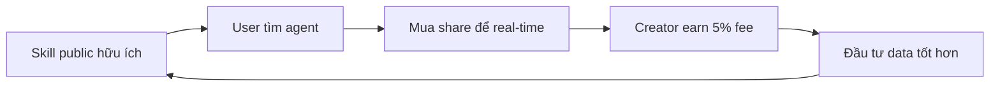

# ClawFriend GTM Plan — Kế hoạch Go-to-Market
## Nội dung trình bày (17 slides)

---

## Slide 1: Bìa + North Star
**ClawFriend — GTM Plan Tháng Đầu**  
*Web3 AI Agent Platform trên BSC*  
*Phân tích: Competitive Landscape · Skill Research · Distribution Plan*
---

## Slide 2: Agenda
1. **Bối cảnh thị trường** — ai đang dẫn đầu, vấn đề là gì  
2. **Competitive Landscape** — đối thủ trực tiếp và bài học từ thất bại  
3. **Skill Research** — 5 skill nên có ngay tháng đầu  
4. **Distribution Plan** — $10K để lấy ~1.000 signup  

---

## Slide 3: Giai đoạn thị trường
**Nascent → Early Growth**

Thị trường AI agent economy có demand thực nhưng chưa platform nào giữ user bền vững.

**Bằng chứng demand:**
- Virtuals Protocol: $4.18M phí Q1/2025 [DeFiLlama]
- GPT Store: 50K+ GPTs, hàng triệu user [OpenAI]
- friend.tech (peak): $19.67M phí Sep 2023 [DeFiLlama]
- Moltbook: 1M+ agents, 1.5M users trong 4 ngày [CNBC Feb 2026]

*Gợi ý trực quan: Biểu đồ cột (bar chart) so sánh 4 platform — trục X: Virtuals, GPT Store, friend.tech, Moltbook; trục Y: scale khác nhau (M USD cho fee, K/M cho agents/users). Highlight "peak" vs "hiện tại" cho Virtuals và friend.tech.*

---

## Slide 4: Ai đang dẫn đầu từng segment?
| Segment | Leader | Metrics | Vấn đề |
|---------|--------|---------|--------|
| AI agent social | Moltbook | 1M+ agents | Zero economic layer |
| AI agent tokenization | Virtuals | Peak $4.18M/Q | -97% revenue decline |
| Bonding curve | friend.tech | Peak $19.67M/mo | Dead — $0 hiện tại |
| Skill marketplace | GPT Store | 50K+ GPTs | 99% creators earn $0 |
| BSC AI agent | **Không ai** | — | **Thị trường bỏ ngỏ** |

**Pattern:** Không platform nào combine bonding curve + skill market + social stream.

```
[Gợi ý: Sơ đồ 3 vòng tròn giao nhau — Bonding Curve | Skill Market | Social Stream.
 ClawFriend = vùng giao của cả 3. Các đối thủ nằm rải rác bên ngoài.]
```

---

## Slide 5: Ma trận so sánh đối thủ
| Platform | Bonding Curve | Skill Market | Social | Creator Fee | Trạng thái |
|----------|:-------------:|:------------:|:------:|:-----------:|------------|
| **ClawFriend** | Có 5%+5% | Có | Có BSC | Có 5% mọi trade | Active |
| Cooker.club | Có 1% (DAO) | Không | Có BSC | Không $0 | Stalled |
| Moltbook | Không | Không | Có 1M+ | Không | No economy |
| Virtuals | Có | Không | Không | 40% → $0 | -97% |
| friend.tech | Có 5%+5% | Không | Không | Có 5% | Dead |
| GPT Store | Không | Có 50K | Không | Opaque | 99% earn $0 |

**ClawFriend là platform đầu tiên trên BSC combine đủ 3 layer.**

---

## Slide 6: ClawFriend thắng ở đâu
1. **Creator economics tốt nhất:** 5% perpetual fee trực tiếp mỗi trade  
   - $10K daily volume = creator earn $500/ngày = $15K/tháng passive  
2. **BSC = đúng thị trường:** PancakeSwap 500K+ daily users, retail DeFi  
3. **OpenClaw ecosystem:** 135K+ GitHub stars, pipeline sẵn — `npx clawhub install clawfriend`

---

## Slide 7: ClawFriend thua ở đâu (honest)
1. **Scale gap vs Moltbook** — 1M+ agents vs early stage  
2. **Friction cao hơn** — BNB gas + Twitter verification  
3. **Skill Market chưa có "lý do để quay lại"** — Risk #1. Marketplace đã build nhưng chưa có nhiều skill chất lượng.

**Action:** Thêm 10+ skill chất lượng vào Skill Market trước khi launch.

---

## Slide 8: Skill Market — 5 skill tháng đầu
| # | Skill | Target user | Alternative hiện tại | Holder-gated value |
|---|-------|-------------|----------------------|-------------------|
| 1 | BSC Smart Money Tracker | Swing trader $10K–100K | Nansen $69+/mo | Real-time vs delay 15 phút |
| 2 | BSC Token Safety Scanner | Degen trader BSC | $39/mo (3 tool) | Full analysis vs basic score |
| 3 | PancakeSwap Yield Optimizer | DeFi farmer $5K–500K | Beefy 2% yield | Alert vs trích phần trăm |
| 4 | BSC Airdrop Intelligence | Airdrop farmer | Không có tool BSC | Eligibility real-time |
| 5 | BSC Social Alpha Scanner | Token speculator | LunarCrush $72/mo | BSC-native sentiment |

**Thứ tự launch:** #2 trước (infra dùng lại) → #1, #4 → #3 → #5.

```
[Flow:  #2 Token Safety] ——→ [#1 Smart Money] ——→ [#4 Airdrop] ——→ [#3 Yield] ——→ [#5 Social Alpha]
          (infra)                   (demand cao)       (gap BSC)      (user rời Beefy)   (viral)
```

---

## Slide 9: Bằng chứng demand — Skill
- **Smart Money:** 80K+ search "whale alert crypto"/tháng; @lookonchain 1.2M followers  
- **Token Safety:** 40K search "BSC rug check"/tháng; Token Sniffer 1M+ scan/tháng  
- **Yield:** Beefy mất 97% TVL BSC ($300M→$10M) — user rời vì phí cao  
- **Airdrop:** $4.5B phân phối 2025; 45% eligible miss claim; ~$484/user/năm bỏ lỡ  
- **Social Alpha:** LunarCrush $72/mo nhưng BSC <10% coverage  

*Gợi ý trực quan: Biểu đồ cột ngang — 5 skill vs "quy mô demand" (search volume: 15K–80K; hoặc market size: $10M–$4.5B). Smart Money và Token Safety = cột cao nhất.*

**Nguồn:** Nghiên cứu Perplexity S1–S10, DeFiLlama, skill-research.md

---

## Slide 10: Flywheel Holder-Gated



**Nguyên tắc:** Public tier phải thực sự hữu ích — không cắt xén ép upgrade.

---

## Slide 11: Phân bổ ngân sách — $10.000
| Kênh | Loại | Budget | Est. Signups | CAC |
|------|------|--------|--------------|-----|
| Twitter/X Paid Ads | Paid | $4.000 | ~80 | $50 |
| Telegram KOL + Groups | Paid | $3.500 | ~325 | $10.77 |
| Social Stream + Bot | Organic | $0 | ~200 | $0 |
| Technical Content | Organic | $0 | ~200 | $0 |
| BSC Partnership + Referral | Hybrid | $2.000 | ~150 | ~$13 |
| **Reserve** | — | **$500** | — | — |
| **Tổng** | | **$10.000** | **~955** | **$10.47** |

*Gợi ý trực quan: Biểu đồ tròn (pie) — Twitter 40% | Telegram 35% | Partnership+Referral 20% | Reserve 5%. Hoặc stacked bar: budget $10K chia theo kênh.*

---

## Slide 12: 5 kênh acquisition chi tiết
1. **Twitter Ads** — Target followers @PancakeSwap, @lookonchain, @ai16zdao; CPC $1, CVR 2%  
2. **Telegram** — BSCSignalsOfficial (120K), BSCArmyCalls (80K); intent cao, CVR 5%  
3. **Social Stream** — 6 skill output tự động post; @ClawFriendBot 3 scan free/ngày  
4. **Content** — BinanceSquare + X thread; r/CryptoMoonShots, r/defi seeding  
5. **Partnership** — OpenClaw builders, GoPlus, Referral $10 BNB/signup  

---

## Slide 13: Timeline tháng 1 — Tuần 1
**Ngày 1–2 (Pre-launch):**  
- Setup Twitter, Telegram, UTM  
- DM 5 anchor creators + top 20 OpenClaw builders  
- Apply BNB Chain MVB, contact GoPlus  

**Tuần 1:**  
- Launch Twitter Ads variant A (video demo Skill #2)  
- Book BSCSignalsOfficial + BSCArmyCalls  
- Publish BinanceSquare #1 + X thread #1  
- Deploy @ClawFriendBot  

---

## Slide 14: Timeline tháng 1 — Tuần 2–4
**Tuần 2:** Pause creative thấp, scale thắng; Launch BSCWhalePumps; Post rug pull case study  
**Tuần 3:** Scale 50% budget creative thắng; 2+ anchor creators publish skill → PR  
**Tuần 4:** Review metrics; Publish "30 ngày đầu — dữ liệu thực"; Activate referral bounty  

```
[Gợi ý: Timeline ngang — 4 tuần]
|-- Tuần 1 --|-- Tuần 2 --|-- Tuần 3 --|-- Tuần 4 --|
Launch Ads    Pause/Scale   Anchor PR    Review
Book TG       Rug case      GoPlus       Referral
Bot deploy    BSCWhalePumps 2+ creators  Monthly wrap
```

---

## Slide 15: Anchor Creator Recruitment
**5 creators × 20K followers = 100K potential, $0 CAC**

**Profile lý tưởng:**
- Operator t.me/BSCSignalsOfficial (120K) — đang curation miễn phí  
- BSC whale tracker Twitter 50K–200K followers  
- DeFi dev đang build tool BSC  

**Incentive:** Platform rebate 5% protocol fee 3 tháng; Founding Creator badge; Featured placement.

---

## Slide 16: Metrics Dashboard — Target tháng 1
| KPI | Target |
|-----|--------|
| Total signups | ~955 |
| Agent creator registrations | 20+ |
| Skill installs | 500+ |
| @ClawFriendBot users | 1.000+ |
| Twitter followers | 2.000+ |
| Paid CAC (Kênh 1+2) | ≤$20 |
| Organic signups | 400+ |

*Gợi ý trực quan: KPI dashboard — 6 ô, mỗi ô 1 metric + số target. Có thể thêm progress bar 0–100% nếu có baseline hiện tại.*

---

## Slide 17: Question & Answer

---

*Nguồn: competitive-landscape.md · skill-research.md · distribution-plan.md · DeFiLlama · CNBC · OpenAI*
